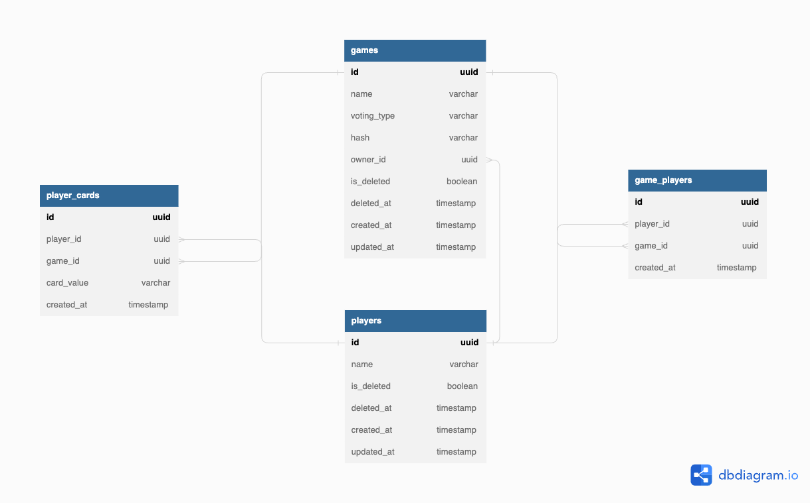

<p align="center">
  <a href="https://www.typescriptlang.org/" target="blank"></a>
</p>

<p align="center">
  Server-side app providing a real time planning poker
</p>

<p align="center">
  
  
  
  
  
  
  
</p>

<p align="center">
  
</p>
<p align="center">
  
</p>

## Table of contents

- [Database modeling](#database-modeling)
- [Use Cases](#use-cases)
- [Technologies](#technologies)
- [Installation](#installation)
- [Running the app](#running-the-app)
- [Tests](#tests)

## Database modeling

<p align="center">
  
</p>

## Use Cases

- Users can create a player account;
- Users can create a game;
- Users can edit their game;
- Users can join games from other users;
- Users can pick card and remove cards;
- Users can reveal all cards of the round;

## Technologies

- Typescript
- Node.js
- ExpressJS
- Socket.io
- PostgreSQL
- Docker / Docker Compose
- Jest

## Installation

```bash
$ npm install
$ yarn
```

## Running the app

```bash
$ npm run start:dev
$ yarn start:dev
```

## Tests

```bash
$ npm run test
$ yarn test
```

## License

[MIT licensed](LICENSE).
